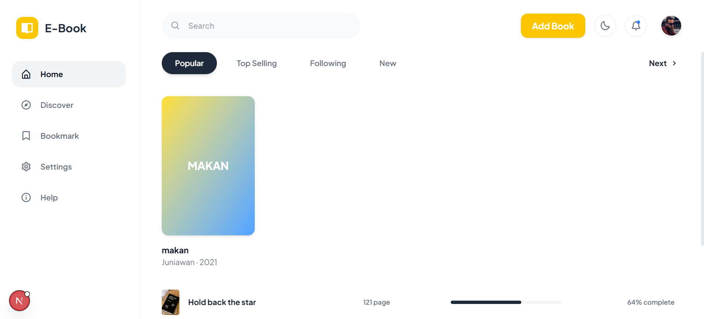
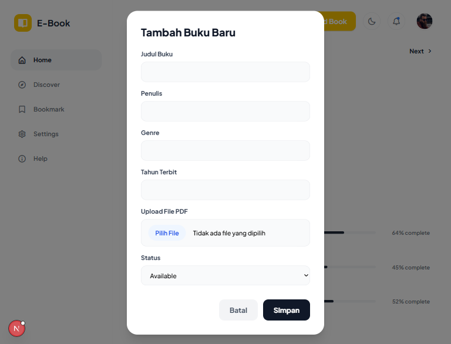
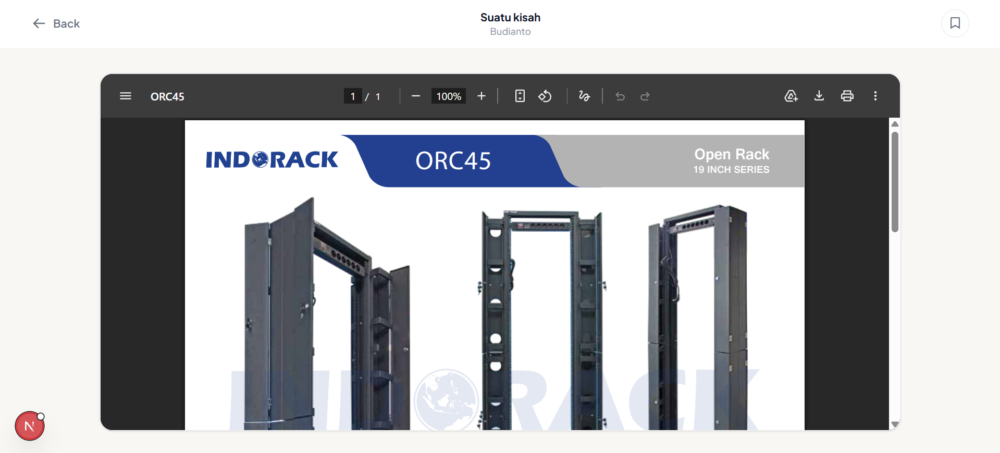

# E-Book – Aplikasi Untuk Menyimpan Buku Digital

E-Book adalah aplikasi untuk menyimpan buku digital yang dibangun dengan **Next.js (Front-End) dan Express.js (Back-End)**. Aplikasi ini memungkinkan pengguna untuk menyimpan buku, membaca buku, dan banyak lainnya. 

Data buku berasal dari data yang dimasukkan oleh user sendiri yang kemudian akan disimpan di mongodb.

# Hal Tambahan Yang Perlu Diinstall
- Docker (untuk menjalankan mongodb)
- Atau install mongodb secara langsung

# Anggota Kelompok
- I Made Gilang Pradnyananda 
- Arif Budianto
- Markus Ndara Bali
- Muhammad Aldiansyah Putra
- Muhammad Samsul Arif Ass'ad (Mengundurkan diri)

# Fitur-Fitur

- Menambahkan Buku
- Membaca Buku
- Mengembalikan Buku

# Cara Menjalankan Proyek (Isi sesuai yang dibuat)

1. **Clone repository**
    
    ```bash
    git clone https://github.com/putra2078/Libraspire-web-app
    cd Libraspire-web-app
    ```
    
2. **Buat file `.env.local`** di Front-End, isi dengan:
    
    ```
    NEXT_PUBLIC_BASE_URL=http://localhost:8001
    ```
    
3. **Buat file `.env`** di Back-End, isi dengan:
    
    ```bash
    PORT=8001
    ```

4. **Install dependencies Front-End**
    
    ```bash
    cd libraspire-fe/
    npm install
    ```

5. **Install dependencies Front-End**

    ```bash
    cd ../server
    npm install
    ```

6. **Setup MongoDB menggunakan docker-compose:**

    ```bash
    cd ../
    docker compose up -d
    ```
7. **Jalankan server Back-End:**

    ```bash
    cd server/
    node main.js
    ```
8. **Jalankan server front-End:**

    ```bash
    cd ../libraspire-fe
    npm run dev
    ```
9. **Buka browser di `http://localhost:3000`**
---

## Struktur Folder (Relevan)

```
libraspire-web-app/
├── libraspire-fe/                    # Kode Front-End
|   ├── app/
|   |   ├── (dashboard)/              # Halaman awal
|   |   |   ├── layout.tsx
|   |   |   └── page.tsx
|   │   ├── read/[id]/page.tsx        # Halaman baca buku
|   │   ├── service/axios.ts          # Mengatur setiap request ke Back-End
|   │   └── layout.tsx                # Layout utama
|   ├── components/
|   │   ├── AddBookModal.tsx          # Pop-up saat menambahkan buku
|   │   ├── BookDetailsModal.tsx      # Menampilkan pop-up informasi buku saat diklik
|   │   ├── Header.tsx                # Component Header
|   │   ├── SideBar.tsx               # Component SideBar
|   │   └── SuccessModal.tsx          # Pop-up saat berhasil menambahkan buku
|   ├── public/                       # Gambar static
|   ├── .env.local                    # Environment variables
|   └── package.json
├── server/                           # Kode Back-End
|   ├── uploads/                      # Tempat pdf buku disimpan
|   ├── .env                          # Environment variables
|   └── main.js                       # Kode utama
└── docker-compose.yaml               # Setup mongoDB menggunakan docker
```

---

## Screenshot (Contoh – bisa diganti dengan gambar asli)

| Halaman Beranda | Tambah Buku | Halaman Baca Buku |
| --- | --- | --- |
|  |  |  |

## Pengujian (Test Case Singkat)

| Fitur | Langkah Pengujian | Hasil Diharapkan |
| --- | --- | --- |
| Menambahkan Buku | Klik tombol `Add Book`, lalu isi informasi terkait buku | Buku akan muncul di dashboard Home page |
| Membaca Buku | Klik pada buku yang ada, lalu nanti akan muncul pop-up terkait informasi buku tersebut. Lalu klik  `Mulai Membaca` | Page akan berganti ke `read/` |
| Mengembalikan Buku | Kembali ke Home page, lalu klik pada buku yang sudah dibaca tadi. Lalu pada pop-up klik `Kembalikan Buku` | Akan muncul pop-up `Buku Dikembalikan!` dan icon kuning di atas kanan cover buku akan menghilang |

---

## Kredit & Sumber Data

- Ikon dan ilustrasi dari [Boxicons](https://v2.boxicons.com/).
